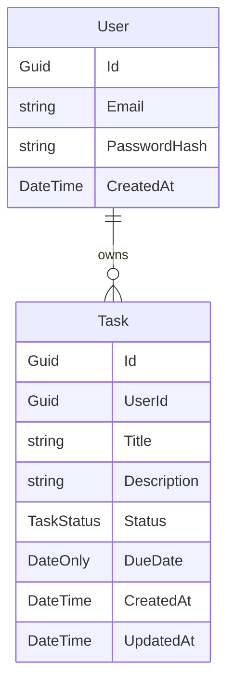

# Domain Model

Shared domain model for backend and frontend. Business rules: [../memory/business-rules.md](../memory/business-rules.md).

## Entities

### User

| Property      | Type     | Notes                |
|---------------|----------|----------------------|
| Id            | Guid     | Primary key          |
| Email         | string   | Unique, required     |
| PasswordHash  | string   | Never plain text     |
| CreatedAt     | DateTime | UTC                  |

### Task

| Property    | Type        | Notes                          |
|-------------|-------------|--------------------------------|
| Id          | Guid        | Primary key                    |
| UserId      | Guid        | FK to User                     |
| Title       | string      | Required                       |
| Description | string?     | Optional                       |
| Status      | TaskStatus  | See enum below                 |
| DueDate     | DateOnly    | Cannot be past on create       |
| CreatedAt   | DateTime    | UTC                            |
| UpdatedAt   | DateTime    | UTC                            |

### TaskStatus (enum)

- `Pending`
- `InProgress`
- `Completed`

## Relationships

One user owns many tasks. A task belongs to exactly one user.
